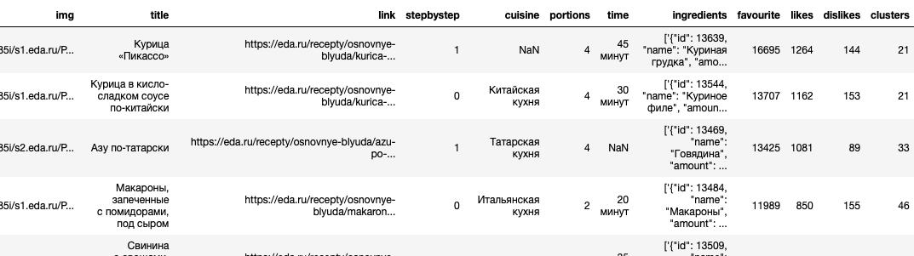
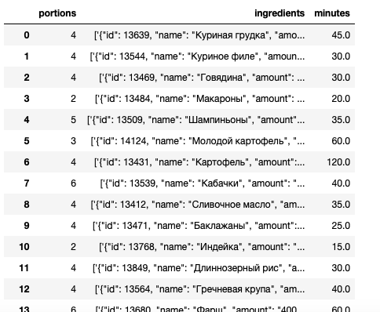
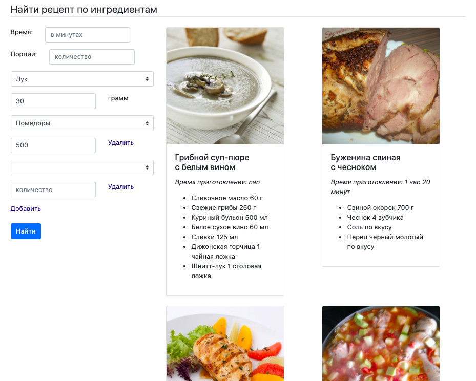

# Рекомендации рецептов

Язык: python 3

Необходимые библиотеки: pandas, numpy, scipy, sklearn, flask, json, pickle

### Описание проекта
Полученное задание звучало как "создание рекомендательной системы на свободную тему с использованием любого известного вам алгоритма машинного обучения".
В качестве предмета рекомендаций были выбраны рецепты главных блюд, а в качесвте алгоритма машинного обучения - кластеризация KMeans из библиотеки sklearn.cluster.
Число кластеров было выбрано методом локтя и равняется 50. На финальном этапе было добавлено ранжирование рецептов в кластерах по количеству совпавших с запросом  пользователя ингредиентов.

### Описание данных
Все данные собраны с сайта eda.ru.

*eda_ru.ipynb* - Jupyter notebook с процессом чистки данных и подбора наиболее подходящей для них модели.

*model.py* - python файл с тренировкой выбранной модели.

*model.pkl* - файл с натренированной моделью.

*eda_total.csv* - таблица 3640 x 12 с данными по рецептам. Колонки: 'img', 'title', 'link', 'stepbystep', 'cuisine', 'portions', 'time',
       'ingredients', 'favourite', 'likes', 'dislikes', 'clusters'.

*eda_log.csv* - та же таблица рецептов, но в другой форме (3640 x 3). Колонки: 'portions', 'ingredients', 'minutes'.

*ingredients_total.json*, *ingredients_total_reversed.json* - json файлы с ингредиентами и их id.

### Фото интерфейса

